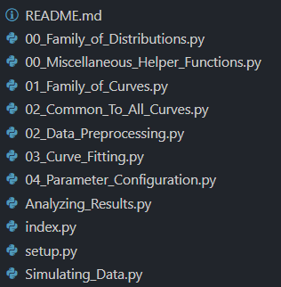

# January 23, 2021
So I want to develop a workflow for debugging/extending what we have of PCITpy. The key difference between what we have here and ICMR is that much of the codebase already exists, while with ICMR we developed notebooks incrementally.

There is no linear structure to what we're doing like there is with ICMR.

But we can readily enforce one: move what we have to a thirdbasis subdirectory, and progressively add content as it fulfills ths requirements of the main workflow.

In the end, I suspect my pattern of weird circular imports has to do with my effort to combine modules rather than the particular sequencing of notebook script compilation. 

So what will I do?
- Reset current set of scripts to another set aside directory.
- Add run_importance_sampler

...No, that seems a bit dramatic. We'll put scripts back in the sequence that makes sense (though we will also keep track of function dependencies) and iteratively set them aside or otherwise revise until the circularity bug is gone.



# January 24
Okay, let's get started. 

I'll maintain a list of issues to eventually address:
- Percent format for script-based notebooks
- Overview notebook for helper subsection
- Apparent circular dependencies depending on order of notebook scripts.
- No clear workflow for iterative improvements
- A world of code to add or test once I have that set up.

We have already renamed each file. Let's reset the various libraries and htmls, and see if I can pull off a `make`. 

The error is reproduced for a few notebooks:

```
converting: C:\Users\gunnj\Google Drive\pcitpy\Miscellaneous_Helper_Functions.ipynb
An error occurred while executing the following cell:
------------------
from nbdev.showdoc import show_doc
from pcitpy.pcitpy import *
------------------

---------------------------------------------------------------------------
ImportError                               Traceback (most recent call last)
<ipython-input-1-f1058062f9de> in <module>
      1 from nbdev.showdoc import show_doc
----> 2 from pcitpy.pcitpy import *

~\Google Drive\pcitpy\pcitpy\pcitpy.py in <module>
      6 # Cell
      7 # hide
----> 8 from .pcitpy import importance_sampler
      9 from scipy.io import loadmat
     10 import os

ImportError: cannot import name 'importance_sampler' from partially initialized module 'pcitpy.pcitpy' (most likely due to a circular import) (C:\Users\gunnj\Google Drive\pcitpy\pcitpy\pcitpy.py)
ImportError: cannot import name 'importance_sampler' from partially initialized module 'pcitpy.pcitpy' (most likely due to a circular import) (C:\Users\gunnj\Google Drive\pcitpy\pcitpy\pcitpy.py)
An error occurred while executing the following cell:
------------------
from nbdev.showdoc import show_doc
from pcitpy.pcitpy import *
------------------
```

It's odd that the bug would start with `Miscellaneous_Helper_Functions` given that the notebook doesn't import pcitpy at all. What is the "cell" being referred to in the traceback? Quite a mystery. 

Anyway, my hypothesis about the errors is that some of my notebooks with within-module dependencies simply must be isolated according to the original conventions of PCITpy. It's a bit awkward (a separate module for every MATLAB file?) but might be totally adequate for the situation.

That seems to fix! And it has a decent semantics; I'd rather be able to import directly from PCIT though.